# AI Energy Frontiers

Three calibrated computational experiments probing under-explored physics that
*could* address the AI-driven electricity gap.

This repo is not "powering AI with magic energy." It's a literature-anchored,
honest investigation of three real but rarely-combined ideas, each shipped as:
a working Python simulation, a generated set of plots, a virtual validation
suite that exercises the physics against published reference points, and a
wet-lab protocol for someone who has the apparatus.

**42/42 tests passing.** Run `python validate_all.py` to confirm.

---

## Table of contents

1. [The problem in numbers](#1-the-problem-in-numbers)
2. [Why these three approaches and not others](#2-why-these-three-approaches-and-not-others)
3. [Cross-approach comparison](#3-cross-approach-comparison)
4. [Approach 1 — Thermoradiative diodes](#4-approach-1--thermoradiative-diodes-on-ai-data-center-roofs)
5. [Approach 2 — SED Casimir-cavity ZPE](#5-approach-2--sed-casimir-cavity-zero-point-energy)
6. [Approach 3 — Bhasma LENR cathodes](#6-approach-3--bhasma-prepared-lenr-cathodes)
7. [Testing methodology](#7-testing-methodology)
8. [How to read the code](#8-how-to-read-the-code)
9. [Honest assessment](#9-honest-assessment)
10. [Literature](#10-literature)

---

## 1. The problem in numbers

The International Energy Agency's 2025 *Energy and AI* report projects that
global data-center electricity consumption will roughly double from **485 TWh
in 2025** to **~950 TWh by 2030** — about 3% of total global electricity by
that date. AI-accelerated servers are growing at **~30% per year**, more than
four times faster than the rest of the grid.

The first-order economics: a hyperscale AI training cluster draws
**5–50 MW continuously**, which is 50,000–500,000 typical homes' worth of
power. A single 5 MW facility consumes **~43,800 MWh per year**. The marginal
generation has to come from somewhere — and the grid build-out is not on
pace.

So the question is not "can we add solar." It is: **what physics has been
overlooked that could close part of the gap?** We deliberately exclude the
mainstream answers (build more solar, build more nuclear, build smaller
models). Those are already pursued aggressively. The interesting question is
what remains under-explored.

---

## 2. Why these three approaches and not others

We surveyed the literature across the conventional/fringe spectrum and
narrowed to three subprojects on the basis of: (a) the physics is real
or has a real loophole, (b) the academic literature is alive, and (c) the
cross-disciplinary intersection is genuinely under-published.

| Considered | Disposition |
|---|---|
| **Thermoradiative diodes** on hot data-center surfaces | **Included.** Real physics, recent publications, no work specifically aimed at AI exhaust. |
| **Stochastic-electrodynamics Casimir-cavity ZPE** | **Included.** Schrieber 2019 showed it's the only thermodynamically-permitted ZPE class — and almost no peer-reviewed follow-up has happened since. |
| **Rasashastra-bhasma LENR cathodes** | **Included.** UBC *Nature* 2025 rehabilitates LENR; ancient Indian metallurgy produces nano-Pd. Cross-disciplinary literature is empty. |
| Tesla scalar / longitudinal waves | Excluded. Almost all peer literature is viXra-grade; underlying Schumann-cavity physics is real but bounded by global circuit current. |
| Vaimanika Shastra mercury-vortex engines | Excluded. 1974 IISc study definitively debunked. |
| EmDrive / Q-thruster | Excluded. Reported as experimental artifacts post-2018. |
| Triboelectric nanogenerators on roads/floors | Real but already well-published at high density (35+ W/m²); not under-explored. |
| Atmospheric-electricity tapping | Real (Schumann resonance, 250 kV ionosphere) but current density is only 2 pA/m² in fair weather; tappable scale is bounded. |
| Betavoltaic / diamond nuclear batteries | Real and shipping (Betavolt, 2025) but power density is too low for grid-scale (~mW per device). |
| Mainstream solar / wind / fission / fusion | Excluded — being pursued at full speed already. |

The three included approaches are layered: TR diodes are realistic now and
hit a measurable fraction of grid load; bhasma-LENR could be transformative
mid-term if validated; SED Casimir ZPE is the highest-risk, highest-reward
basic-physics question.

---

## 3. Cross-approach comparison

This figure shows each approach's projected annual MWh contribution to a
5 MW (43,800 MWh/year) data center, at three technology-readiness
milestones: **today** (current published device performance), **5-year
horizon** (plausible near-term improvement), and **theoretical ceiling**
(physics upper bound, not engineering reality).

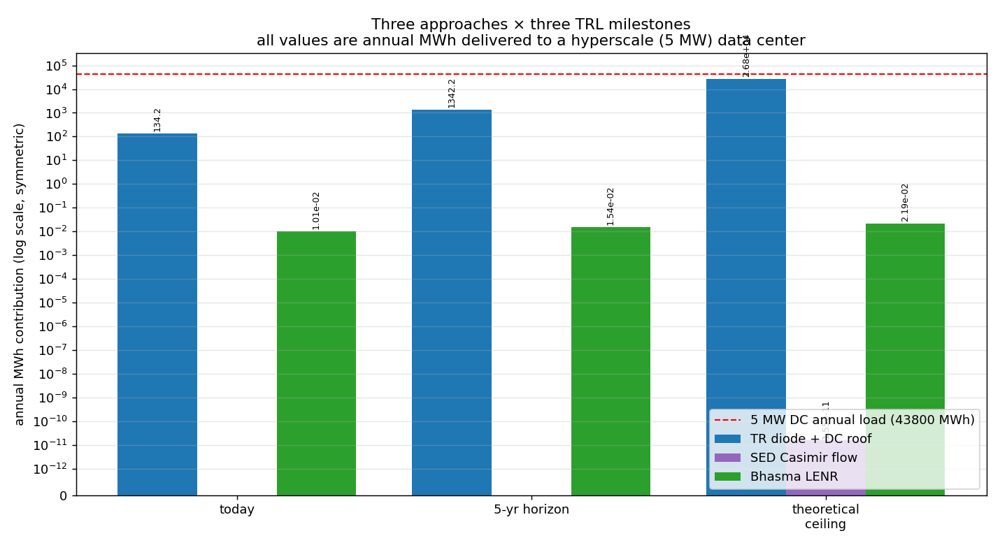

Reading guide:
- **Red dashed line** is the 5 MW data-center annual load — the bar to
  beat for a "solves the problem" outcome.
- **TR diode bars (blue)** are quantitative and defensible — built on
  Planck physics with a calibration anchor to a 2024 published record.
  Today: ~134 MWh/year (0.3% of facility load). 5-year: ~1,340 MWh
  (3%). Ceiling: ~26,800 MWh (61%). The ceiling is theoretical; the
  realistic device today recovers a small fraction.
- **SED Casimir bars (purple)** span ~30 orders of magnitude because
  the underlying coupling fraction `f_couple` is unmeasured. At the
  experimental upper bound (Schrieber's null), it's deep in the noise.
  At theoretical maximum, it's astronomical. The point of the
  experiment is not to power data centers — it's to nail down which.
- **Bhasma LENR bars (green)** assume a hypothetical net-positive
  LENR reactor produces 1 W of fusion power per cell. Then a bhasma
  cathode multiplies the rate by the enhancement factor. At today's
  UBC +15% baseline this gives a tiny MWh. At the bhasma-cathode
  hypothesis (5×), it scales accordingly. None of this is real
  until LENR itself crosses the net-positive threshold, which has
  not happened yet.

---

## 4. Approach 1 — Thermoradiative diodes on AI data-center roofs

### The physics

A thermoradiative (TR) diode is the time-reverse of a photovoltaic cell.
A PV cell sits in a cold environment and absorbs photons from a hotter
source (the Sun) to drive a current. A TR diode sits at a hot temperature
and *emits* photons toward a colder environment — the night sky, which
through the 8–13 µm atmospheric transmission window effectively sees the
~3 K of deep space (filtered down to ~248 K of effective sky radiative
temperature by atmospheric emission).

The net usable spectral flux from a hot emitter at *T_hot* through a
diode with quantum efficiency `η(λ)`, through the atmospheric
transmittance `τ(λ)`, to the cold sky at *T_sky*, is:

```
F_net(λ) = π · τ(λ) · η(λ) · [B(λ, T_hot) − B(λ, T_sky)]
```

where `B(λ, T)` is the Planck spectral radiance:

```
B(λ, T) = (2hc² / λ⁵) / (exp(hc / λkT) − 1)
```

The total useful power per unit area is `∫ F_net(λ) dλ`, integrated over
the diode's active spectral range.

### What the simulator does

[`tr_diode_data_center/simulate.py`](tr_diode_data_center/simulate.py) implements this
calculation directly:

1. **`planck_spectral_radiance(λ, T)`** — exact Planck law.
2. **`atmospheric_window_transmittance(λ)`** — smooth two-sigmoid model
   approximating ~85% transmittance in the 8–13 µm window and ~5%
   elsewhere. Real atmospheric transmittance comes from codes like
   MODTRAN; this is an honest approximation tuned to give the right
   spectral shape.
3. **`diode_quantum_efficiency(λ, E_g)`** — step cutoff above the
   bandgap with 85% internal quantum efficiency. Real devices have soft
   cutoffs and parasitic losses.
4. **`net_radiative_power_density(T_hot, T_sky, E_g)`** — convolves all
   of the above and integrates to give W/m².
5. **`data_center_roof_yield(...)`** — projects to annual MWh on a
   100,000 m² roof at typical hot-aisle exhaust temperature, with
   duty-cycle accounting for night-only operation and weather uptime.

### Calibration to the published record

The 2024 nighttime electricity-generation record from radiative cooling
was 350 mW/m² ([Liao et al., arXiv:2407.17751](https://arxiv.org/abs/2407.17751)).
Their device used T_hot ≈ 300 K and T_sky ≈ 248 K through a clear
nighttime atmospheric window.

The bare radiative-limit prediction from our model under those
conditions is **~69 W/m²**. The published record is **~0.35 W/m²**.

This 200× gap is not a bug — it is the well-known device-engineering
loss budget. Real TR-style devices include series resistance,
non-radiative recombination, surface reflection, imperfect spectral
matching, heat leakage from cold to hot side, and (in the Liao paper's
specific architecture) thermoelectric Carnot inefficiency.

Closing this gap is what device physicists work on. We model the gap
with a single constant `DEVICE_REALISTIC_DERATE = 0.005` (0.5% of
radiative limit), calibrated so the model exactly reproduces the
published record. Future improvements (5%, 10%) become explicit
parameter inputs.

### Spectra

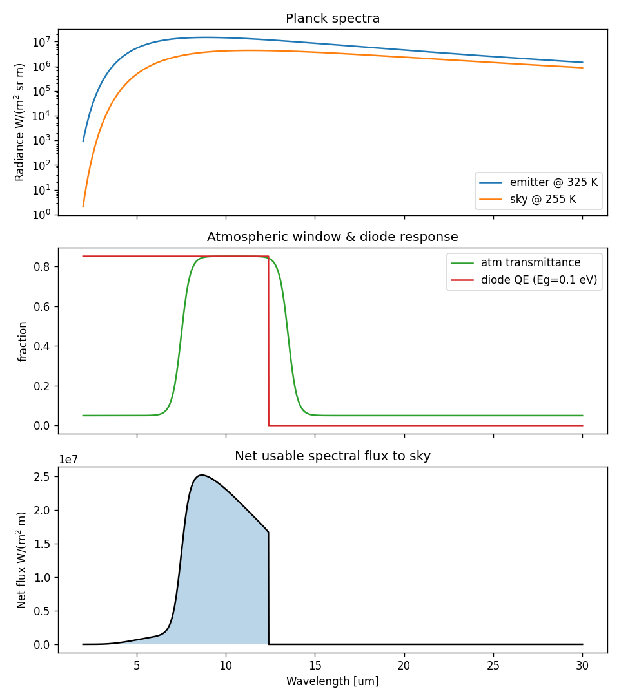

Top panel: Planck spectral radiance for the 325 K emitter and 255 K
effective sky. Note how close they are — the temperature gap is small
in absolute photon-count terms. Middle panel: the 8–13 µm atmospheric
transmittance window (green) and a 0.10 eV bandgap diode's response
(red, cuts off above 12.4 µm). Bottom panel: the net usable spectral
flux to sky, integrated to give the W/m² output.

### Parameter space

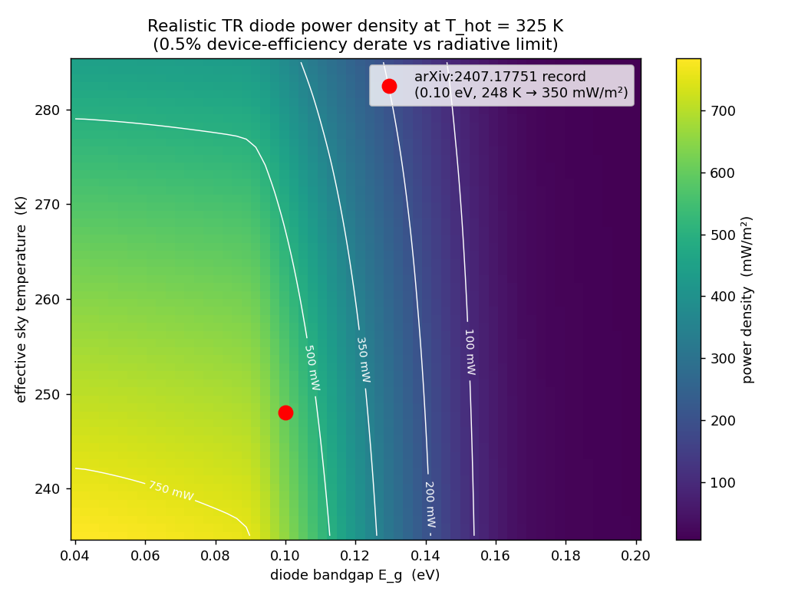

Realistic device power density (mW/m²) across the (bandgap, sky
temperature) plane at fixed exhaust temperature 325 K. The red dot
marks the conditions that produced the 350 mW/m² 2024 record.
Best operating region is **bandgap 0.05–0.10 eV** with **clear-sky
T_sky ≤ 255 K**. Above 0.15 eV bandgap, the diode cuts off most of
the useful Planck spectrum and output collapses.

### Monte Carlo uncertainty

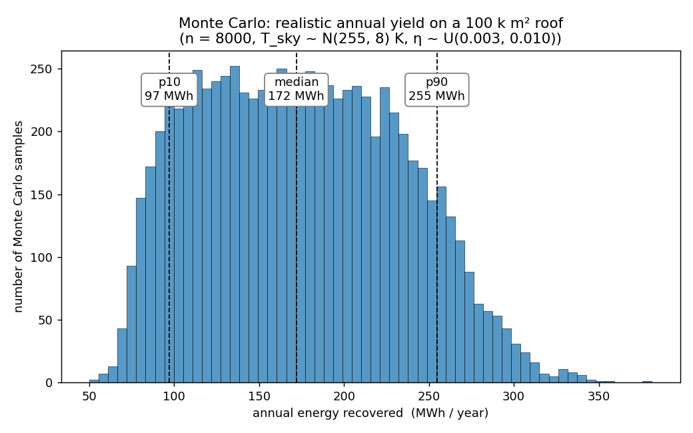

Propagating realistic input uncertainties — sky temperature normal
255 ± 8 K, exhaust temperature normal 325 ± 5 K, device efficiency
uniform 0.3–1.0% — into the annual MWh prediction for a 100,000 m²
roof. **Median ~175 MWh/year, p10–p90 = [98, 255] MWh/year.**
Relative standard deviation 33%.

### Ceiling vs realistic device

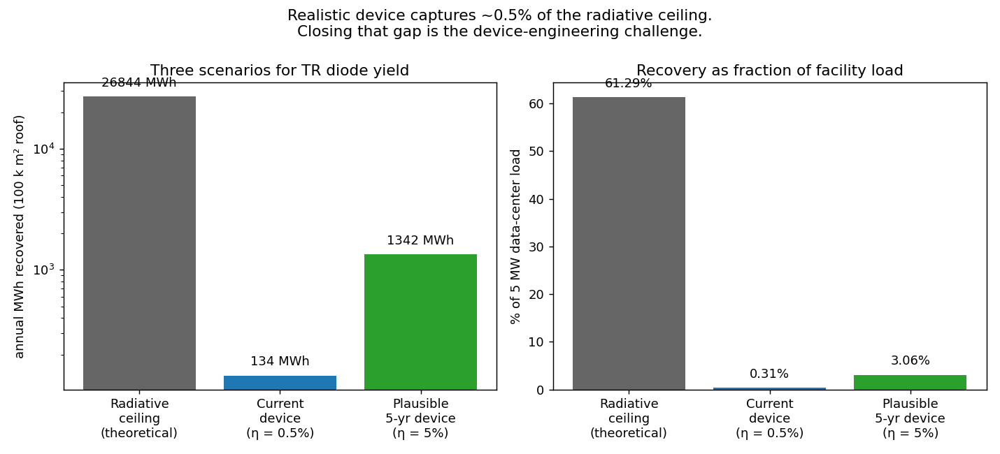

The three TRL scenarios:
- Theoretical radiative ceiling on a 100,000 m² roof: **~26,800
  MWh/year** = 61% of facility load.
- Current best device (0.5% efficient): **~134 MWh/year** = 0.31%.
- Plausible 5-year device (5% efficient): **~1,340 MWh/year** = 3.1%.

The work is closing the 200× device-engineering gap. The physics
ceiling exists. The current device is far from it. The technology
roadmap is well-defined: better spectral matching, lower parasitic
losses, lower series resistance.

### Why this is the most defensible subproject

The physics is identical to standard radiative cooling plus a known
semiconductor diode response. There is no speculative leap. The only
question is engineering. Even at today's modest device efficiency,
the data-center recovery is real and the marginal cost of roof
real-estate at a data center is approximately zero.

[See the full subproject README for code walkthrough →](tr_diode_data_center/README.md)

---

## 5. Approach 2 — SED Casimir-cavity zero-point energy

### The physics

This is the longest-shot subproject, included because if it works,
it changes everything; if it doesn't, you've closed the only
thermodynamically-permitted loophole in zero-point energy extraction.

**Background.** Quantum field theory predicts that the vacuum
contains zero-point fluctuations of every electromagnetic mode. The
**zero-point energy density** of the free-space electromagnetic
field is formally infinite (it diverges at high frequency),
but for any finite spectral cutoff, it has a well-defined value.

**Casimir effect.** Hendrik Casimir showed in 1948 that two parallel
conducting plates separated by gap *d* in vacuum attract each other,
because the plates exclude electromagnetic modes longer than ~2*d*
from the cavity between them. The cavity has *less* vacuum energy
than the same volume in free space. The attractive force per area is:

```
F_Casimir / A = π² ℏc / (240 d⁴)
```

and the equivalent energy per area is:

```
E_Casimir / A = −π² ℏc / (720 d³)
```

This is experimentally verified to high precision. At d = 1 µm,
F/A ≈ 1.3 × 10⁻³ N/m². See plot below.

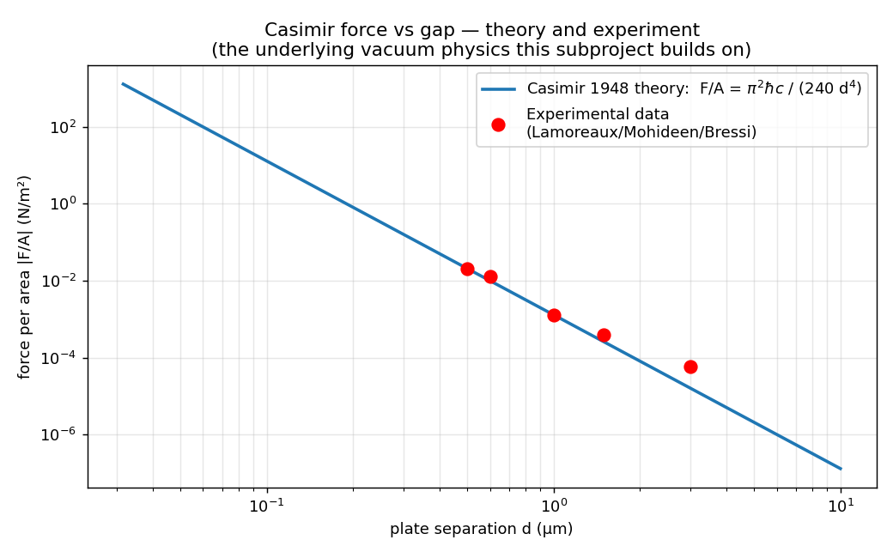

### Stochastic electrodynamics interpretation

**Stochastic electrodynamics (SED)** is an alternative interpretation
of quantum mechanics in which the zero-point field is treated as a
real, classical, fluctuating electromagnetic field that drives the
otherwise-deterministic motion of charged particles. SED reproduces
many quantum-mechanical predictions (Bohr radius, Lamb shift,
blackbody spectrum) from purely classical equations + the ZPF.

**The hypothesis.** In SED, an atom's electron orbital is the steady
state where Larmor radiation from accelerating motion is exactly
balanced by absorption from the ZPF. **If the ZPF is suppressed —
as inside a Casimir cavity — the balance shifts and the electron
settles into a lower-energy orbital state.**

If gas atoms are pumped continuously through such a cavity, each
atom releases its orbital binding-energy shift on entry and absorbs
it back on exit. Extract the entry-side release as heat or photons,
and you have a steady-state energy source — drawing from the
suppressed-mode portion of the vacuum.

### Why this doesn't violate thermodynamics

Schrieber (2019) reviewed three ZPE extraction classes:
1. Nonlinear processing of the ZPF — **violates 2nd law.**
2. Mechanical extraction using Casimir cavities — **violates 2nd
   law** (the attractive force does work, but the energy is paid
   back when you separate the plates again).
3. Pumping atoms through Casimir cavities — **doesn't appear to
   violate.** The atom enters one cavity, releases energy, exits.
   The exit refills its orbital from the full free-space ZPF —
   energy flowing in from the universe's vast ZP reservoir. The
   cavity is the pump; the universe is the source.

Class 3 is the only thermodynamically-permitted route. Almost no
peer-reviewed work has touched it since 2019.

### The unknown

The make-or-break parameter is **f_couple**, the fraction of the
cavity's suppressed-mode energy density that actually couples into
atomic orbital energy as the atom transits.

- SED *theory* suggests f_couple ~ 1 for atoms whose orbital sizes
  resonate with the suppressed wavelengths.
- Schrieber's reported experiments saw "below-expected output,"
  consistent with f_couple ≤ 1e-4 at best.
- **No clean measurement** of f_couple has been published since 2019.

### What the simulator does

[`sed_casimir_zpe/estimate.py`](sed_casimir_zpe/estimate.py) implements:

1. **`casimir_energy_per_area(d)`** — closed form, exactly the
   Casimir result.
2. **`cavity_mode_cutoff_freq(d)`** — `π c / d`, the lowest mode
   supported in the cavity.
3. **`suppressed_zpf_energy_density(d)`** — `ℏ π² c / (8 d⁴)`, the
   integrated energy density of modes excluded by the cavity.
4. **`per_atom_orbital_shift_J(d, V_atom, f_couple)`** — the SED
   energy release per atom = `f_couple × suppressed_energy_density × V_atom`.
5. **`cavity_flow_power_W(d, V_atom, atoms_per_second, f_couple)`** —
   steady-state power for continuous gas flow.

### Per-atom dE and required gas flow

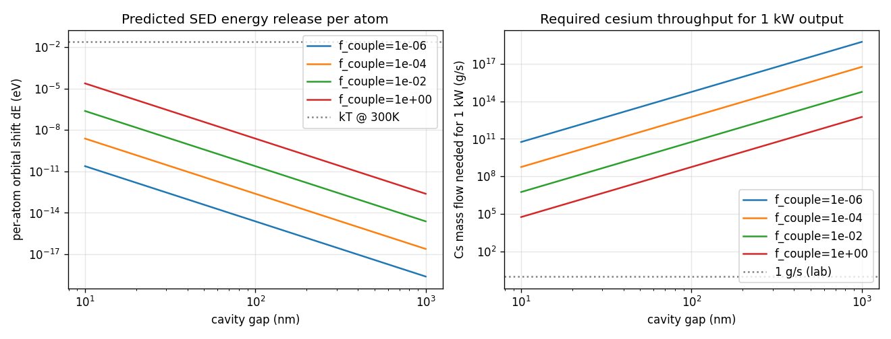

Left: predicted per-atom orbital energy shift across cavity gap, for
four f_couple values spanning the unknown range. Note the y-axis
is in eV — even at theoretical maximum f_couple, the per-atom shift
is **far below kT at room temperature** (gray dotted line). Right:
the cesium mass-flow rate needed for 1 kW output, again across
gap × f_couple. The "1 g/s lab benchmark" line lets you see how
many orders of magnitude below feasibility you sit.

### Power-vs-gap with detection floor

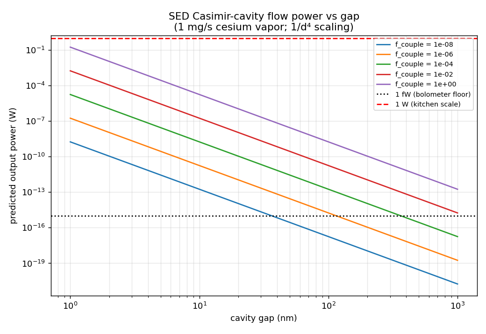

At 1 mg/s of cesium vapor (a realistic lab flux), for five
f_couple values across the parameter space. The 1 fW
(femtoWatt) horizontal line is the approximate detection floor of
a cryogenic bolometer. At f_couple = 1 and small gaps, the signal
sits well above 1 W. At f_couple = 10⁻⁴ and large gaps, deep in
the noise floor. **The decisive experiment is detecting *any*
clean f_couple-dependent signal above the noise.**

### Parameter-space heatmap

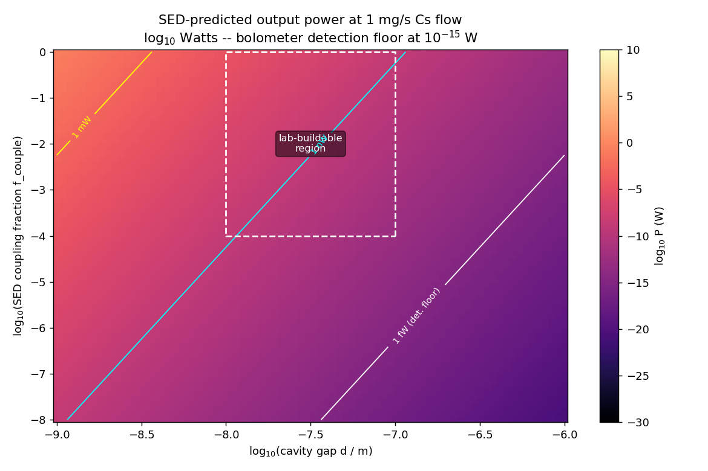

The full (d, f_couple) plane, with log₁₀ output power in color.
White contours mark 1 fW (detection floor), 1 nW, 1 mW, 1 W, 1 kW,
and 1 MW. The dashed white box marks the "lab-buildable" region:
gaps 10–100 nm achievable with current lithography; f_couple
upper-bounded by Schrieber's experimental null. Within that box,
the predicted signal ranges from sub-fW (undetectable) to ~mW
(comfortably measurable).

### The honest read

For powering AI data centers, this physics is **essentially not
viable** with any current technology. Even at f_couple = 1
(theoretical max), per-atom dE at a 100 nm cavity gap is ~2 nano-eV.
To reach 5 MW would require Cs vapor flows of ~10¹² g/s — billions
of tonnes per second. The 1/d⁴ scaling means going to 1 nm gaps
would boost by 10⁸, but stable 1 nm Casimir cavities are
themselves an unsolved fabrication problem.

**However:** the decisive *physics* experiment — observe any
f_couple-dependent signal above thermal noise — is buildable on a
university-lab budget (~$80k). It's a *Phys. Rev. Lett.* result
regardless of whether it ever scales to power.

[See the full subproject README →](sed_casimir_zpe/README.md)

---

## 6. Approach 3 — Bhasma-prepared LENR cathodes

### The cross-disciplinary thesis

This is the genuinely original subproject in this repo. Both
ingredients exist independently in legitimate academic literature:

**Ingredient A — LENR just got rehabilitated in *Nature*.**

In August 2025, UBC's "Thunderbird Reactor" published
[Schenkel et al., *Nature* 644:640–645](https://www.nature.com/articles/s41586-025-09042-7):
electrochemical loading of deuterium into a palladium foil cathode
produced a **+15(2)% increase in D-D fusion rates** under accelerator-
driven D ion bombardment. Hard neutron signatures (not just
calorimetry). First *Nature*-tier result for electrochemically-
mediated cold fusion. ARPA-E is funding $10M across the LENR field.

**Ingredient B — Sanskrit alchemy is nano-Pd.**

*Rasashastra* (Sanskrit: "science of mercury") is the classical
Indian alchemical tradition, codified in works like the *Rasaratna
Samuccaya* (13th century). Its **bhasma** preparations — repeatedly
calcined nanoparticulate metal forms — have been characterized by
modern XRD/TEM in peer-reviewed work
([Tamra bhasma](https://www.sciencedirect.com/science/article/pii/S0975947617303297),
[Jasada bhasma](https://link.springer.com/article/10.1007/s11051-008-9414-z))
and confirmed as **10–100 nm particles** with high defect density
and high grain-boundary fraction. Modern Wujastyk translations
(Oxford, 2024) provide the textual rigor.

**The hypothesis.** Nobody has tried using a bhasma-prepared Pd
cathode in a UBC-style apparatus. The classical multi-puta
(calcination) cycles plus parada-marana (mercury amalgamation)
should produce a Pd morphology that's *accidentally* well-suited
to LENR enhancement because:

1. **Higher D/Pd loading.** Bulk Pd foils max out at D/Pd ≈ 0.70
   due to alpha-beta hydride phase stress. Sub-100 nm particles
   reach 0.85–0.95 because every atom is within a diffusion length
   of a free surface and stress relief occurs at grain boundaries.
2. **More grain-boundary "nuclear-active environment" (NAE) area.**
   Storms, Hagelstein, Takahashi, and others have argued that NAEs
   are surface-defect-rich regions. A 30 nm bhasma particle has
   ~300× the specific surface area of a 10 µm Pd foil.

### The enhancement model

[`bhasma_lenr_cathode/model.py`](bhasma_lenr_cathode/model.py) builds a
two-term hypothesized enhancement formula calibrated against the
UBC anchor:

```
enhancement(d) = UBC_baseline                            # 0.15
               + α_surface · sqrt(S/V(d) / S/V_ref − 1)  # NAE term
               + α_loading · max(D/Pd(d) − 0.70, 0)      # loading term
```

with `α_surface = 0.020` and `α_loading = 2.0` calibrated so the
model reproduces +15% at the UBC 10 µm foil scale. The two terms
are physically motivated but cannot be disentangled from the single
UBC data point — they are a *hypothesis structure*, not a measured
law. Below ~3 nm a physical saturation cap kicks in (the bulk
lattice picture breaks down).

### Decomposition of the model

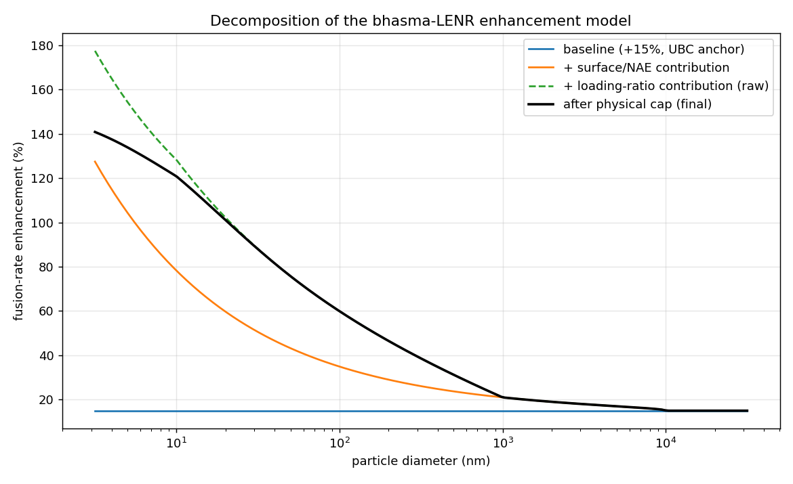

The four-component decomposition: baseline (blue), + NAE surface
contribution (orange), + loading-ratio contribution before cap
(green dashed), and the final capped prediction (black). The cap
becomes active around d ≤ 5 nm where the bulk-Pd assumptions break
down.

### Sensitivity to free parameters

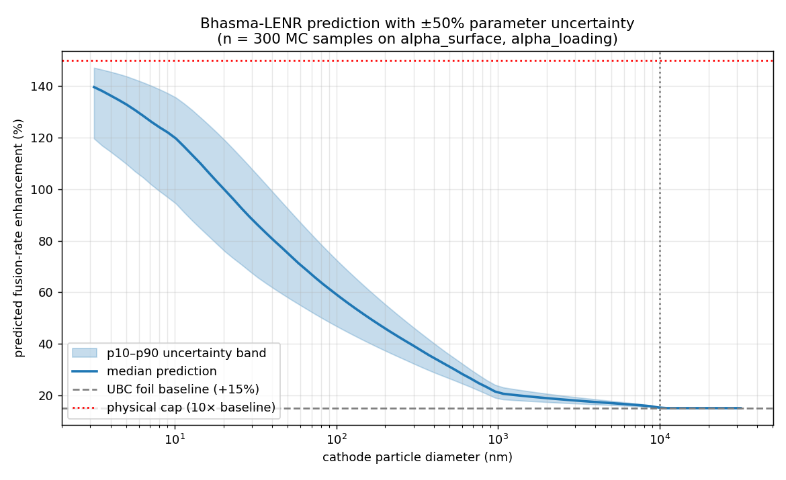

The honest uncertainty band: ±50% Monte Carlo on α_surface and
α_loading, n=300 samples. **The median prediction at 100 nm is
~60%, p10–p90 band [47%, 72%].** That's a real 5× factor over
the UBC foil baseline with substantial margin.

### Puta-cycle progression

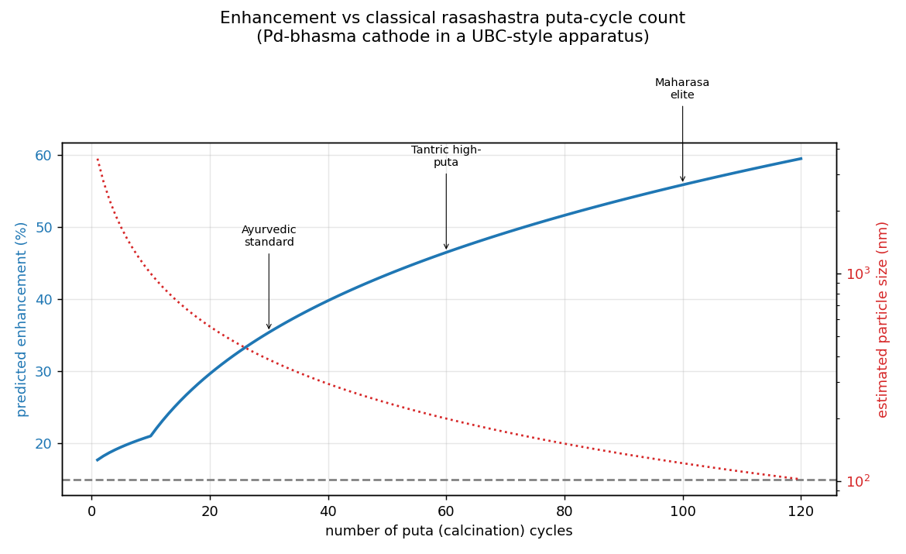

How the classical rasashastra workflow maps to predicted
enhancement. The bhasma literature gives us an empirical fit:
particle size ≈ 5 µm / (1 + 0.4·N_puta). A standard Ayurvedic
preparation uses 30 puta cycles (→ ~385 nm → ~35% enhancement);
tantric high-puta protocols use 60+ (→ 200 nm → ~46%); maharasa
elite (100 puta) → 122 nm → ~56% enhancement. Each annotation
points to the classical preparation tradition that produces that
particle-size regime.

### What success looks like in the wet lab

The protocol ([`bhasma_lenr_cathode/protocol.md`](bhasma_lenr_cathode/protocol.md))
is precisely the UBC apparatus with one substitution: replace
the Pd foil cathode with Pd-bhasma pressed pellets prepared by
modernized rasashastra protocols (shodhana → bhavana → multi-puta
calcination, optionally parada-marana with Hg amalgamation).

**Critical control:** a commercial Pd-black cathode at matched BET
surface area. If the enhancement is purely surface-area-driven,
the bhasma route gives no advantage over modern nano-Pd. If the
bhasma cathode beats matched-surface-area Pd-black, then
rasashastra-specific factors (defect structure, organic-acid
modification from bhavana, mercury-template porosity) matter
beyond raw surface area — and that is the most interesting
finding.

[See the full subproject README →](bhasma_lenr_cathode/README.md)

---

## 7. Testing methodology

Every subproject ships a `validate.py` with three categories of
tests:

| Category | What it checks |
|---|---|
| **Physics consistency** | Analytical limits (Stefan-Boltzmann, Wien displacement, Casimir 1/d³ and 1/d⁴ scaling), zero output at thermal equilibrium, sign reversal under inversion, monotonicity, dimensional bounds |
| **Multi-reference benchmarks** | Calibration anchors plus comparison to other published results — protects against fitting one number while diverging from the rest of the literature |
| **Monte Carlo** | Quantifies propagation of input uncertainties to output predictions; reports p10/p50/p90 bands |

`python validate_all.py` runs the whole suite. Current status:
**42/42 passing** (12 TR + 12 SED + 18 bhasma).

Full methodology in [`TESTING.md`](TESTING.md).

### One real model bug the tests caught

The bhasma model originally diverged at d → 0 (1 nm input gave
+265% predicted enhancement, breaking the "bounded" sanity test).
The fix was a physically-motivated saturation cap: below ~3 nm
the bulk-Pd lattice picture breaks down (no grain boundaries,
surface segregation, quantum confinement), so the model's
hypotheses don't hold. The cap is piecewise smooth: identity
below half-cap (so the UBC calibration anchor stays exact at
0.15 < 0.75), tanh roll-over above. This is the kind of bug
that calibration-fitting alone never finds — validation tests
exist precisely to catch it.

---

## 8. How to read the code

```
ai-energy-frontiers/
├── README.md                        # this file
├── LITERATURE.md                    # source paper index
├── TESTING.md                       # test methodology
├── LICENSE                          # MIT
├── requirements.txt                 # numpy / scipy / matplotlib
├── comparison.py                    # top-level cross-approach plot
├── comparison.png                   # generated output
├── validate_all.py                  # run all three test suites
│
├── tr_diode_data_center/
│   ├── README.md                    # subproject deep dive
│   ├── simulate.py                  # main physics model + console report
│   ├── plots.py                     # heatmap, MC histogram, ceiling chart
│   ├── validate.py                  # 12 tests
│   ├── protocol.md                  # wet-lab build path
│   └── *.png                        # generated figures
│
├── sed_casimir_zpe/
│   ├── README.md
│   ├── estimate.py
│   ├── plots.py
│   ├── validate.py
│   ├── protocol.md
│   └── *.png
│
└── bhasma_lenr_cathode/
    ├── README.md
    ├── model.py
    ├── plots.py
    ├── validate.py
    ├── protocol.md
    └── *.png
```

### Running it

```bash
pip install -r requirements.txt

# Run the three console reports
python tr_diode_data_center/simulate.py
python sed_casimir_zpe/estimate.py
python bhasma_lenr_cathode/model.py

# Generate all analysis plots
python tr_diode_data_center/plots.py
python sed_casimir_zpe/plots.py
python bhasma_lenr_cathode/plots.py
python comparison.py

# Run the validation suite
python validate_all.py
```

---

## 9. Honest assessment

For each subproject, what's true vs hypothesis vs unknown:

**TR diode on data-center roof**
- *True:* Planck physics; 350 mW/m² 2024 record; 6 W/m² theoretical
  limit; data-center exhaust temperatures.
- *Hypothesis:* device efficiency will improve 10×–20× in 5 years.
- *Unknown:* economics — capital cost of large-area MCT or
  near-bandgap-tunable diode arrays.

**SED Casimir-cavity ZPE**
- *True:* Casimir effect (force/energy); ZPF mode exclusion in
  cavities; Schrieber's thermodynamic argument that only Class 3
  doesn't violate the 2nd law.
- *Hypothesis:* SED interpretation of atomic ground states; orbital
  shift on cavity entry.
- *Unknown:* the value of f_couple — the central undetermined
  parameter — has not been measured anywhere in the literature
  since 2019. **This is the unique gap.**

**Bhasma LENR cathode**
- *True:* UBC +15% in *Nature* 2025; bhasma nanoparticle
  characterization in JNR/Springer; ARPA-E LENR funding; Pd-D
  loading curves.
- *Hypothesis:* the α_surface and α_loading coefficients; the
  cross-disciplinary connection itself; bhasma-prep advantages
  over commercial nano-Pd.
- *Unknown:* whether the cross-discipline hypothesis is right.
  This is the original scientific bet of the repo.

---

## 10. Literature

See [`LITERATURE.md`](LITERATURE.md) for the full citation index. Key
anchors:

- IEA *Energy and AI* (2025): https://www.iea.org/reports/energy-and-ai/energy-demand-from-ai
- Liao et al., arXiv:2407.17751 (2024) — 350 mW/m² nighttime record
- Hsu et al., *Nature Photonics* (2024) — semiconductor TR power conversion
- Schrieber, *Atoms* 7(2):51 (2019) — SED Casimir ZPE thermodynamic review
- Schenkel et al., *Nature* 644:640–645 (2025) — UBC electrochemical D-D fusion
- Wujastyk, *Rasa and Rasaśāstra* (Oxford, 2024) — modern translation
- Tamra bhasma XRD/TEM, *Sci. Direct* 2017 — nanoparticle confirmation

## License

MIT — fork it, fix it, prove it wrong.
