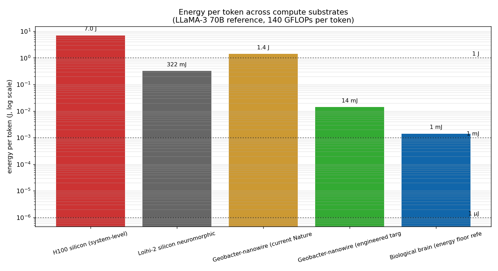
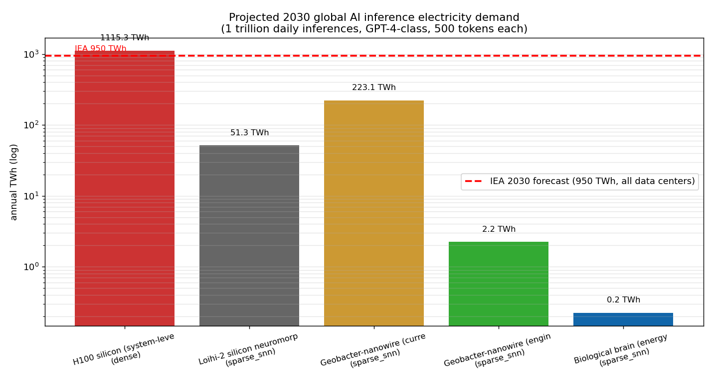
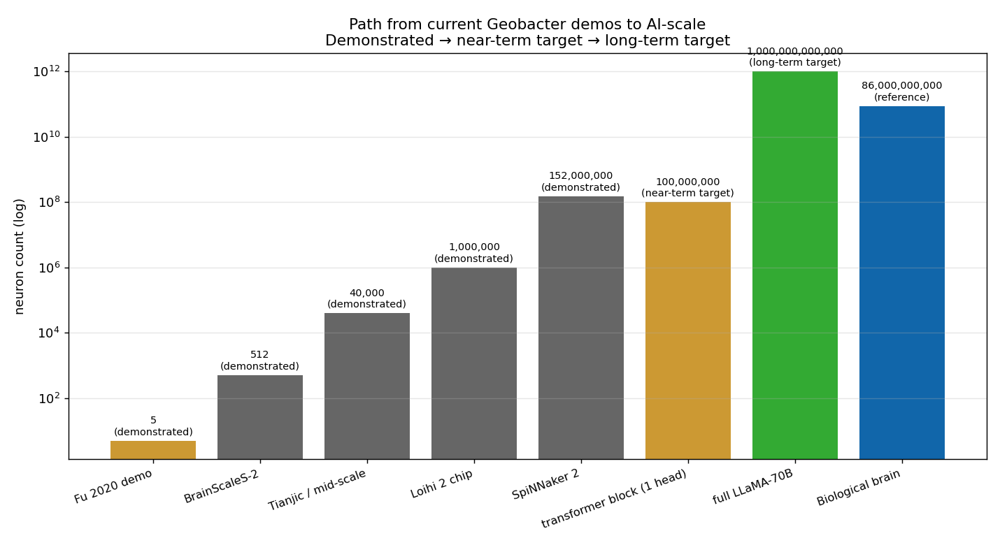

# Bacterial neuromorphic substrate for AI inference


The fourth subproject and the only one that attacks the AI-energy gap **from the demand side**. Instead of generating more energy to feed silicon AI compute, change the compute substrate to one that needs 100–1000× less energy per inference.

This is the **biggest potential lever in the repo** — if it works, it removes ~99% of the AI-energy problem rather than incrementally adding to supply. It is also engineering-uncertain: the physics has been demonstrated; the integration to transformer-scale has not.

## Table of contents

1. [The two ingredients](#1-the-two-ingredients)
2. [The supply-vs-demand framing](#2-the-supply-vs-demand-framing)
3. [The physics](#3-the-physics)
4. [The energy comparison](#4-the-energy-comparison)
5. [The code](#5-the-code)
6. [Plots](#6-plots)
7. [Honest assessment](#7-honest-assessment)
8. [References](#8-references)

---

## 1. The two ingredients

### Ingredient A: AI compute is bottlenecked by silicon's energy floor

Modern transformer inference on H100-class silicon uses **~50 pJ per useful FLOP** at the system level (raw arithmetic is ~1 pJ/FLOP but memory access, interconnect, and idle power dominate). A LLaMA-3 70B-class forward pass is ~140 GFLOPs per token. So inference is **~7 J per token unbatched** (~0.7 J per token with production batching). At 100 tokens/sec that is ~70 W of continuous draw per single-GPU inference stream.

The energy floor for CMOS isn't going to drop much further. Gate voltage cannot fall below ~0.6 V without exponentially-growing leakage. Memory access dominates; the "memory wall" is the well-known scaling brick wall for AI silicon.

### Ingredient B: protein nanowires from *Geobacter sulfurreducens* hit biological energy/voltage parameters

In 2020, Fu et al. ([Nature Communications 11, 1861](https://www.nature.com/articles/s41467-020-15759-y)) reported memristors built from protein nanowires harvested from *Geobacter sulfurreducens*. Subsequent papers from the Lovley and Yao labs at UMass Amherst have built artificial neurons on this substrate that operate at:

| Parameter | Silicon CMOS | Biological neuron | Geobacter nanowire neuron |
|---|---|---|---|
| Operating voltage | 0.7–1.0 V | 70–130 mV | **70–130 mV** (1st non-bio to hit this) |
| Energy per spike | ~1–10 nJ | 0.3–100 pJ | **0.3–100 pJ** (matches biology) |
| Switching time | ~1 ns | ~1 ms | ~1 ms |
| Substrate | semiconductor fab | aqueous lipid bilayer | protein nanowire on conductive substrate |

The voltage match is the bigger deal than it sounds: *every other artificial neuron in the literature operates at silicon-level voltages*. Cutting V_op from 0.7 V to 0.1 V cuts energy by 50× *immediately*, before any architectural improvements.

## 2. The supply-vs-demand framing

The first three subprojects in this repo attack AI's electricity gap by trying to **generate more energy**:

| Subproject | Attack vector |
|---|---|
| TR diode | Recover waste heat radiating to night sky |
| SED Casimir | Extract energy from vacuum mode exclusion |
| Bhasma LENR | Enhance D-D fusion in nano-Pd cathodes |

This subproject attacks the **demand side**:

> If a transformer inference needs 100× less energy on a biological-efficiency substrate, the supply problem largely disappears.

These are not alternatives — they are layers. Reducing demand by 10× *and* increasing supply by 10× gives 100× headroom. The bacterial neuromorphic substrate is the under-explored demand lever.

## 3. The physics

### Protein nanowire structure

*Geobacter sulfurreducens* is a soil bacterium that grows pili — protein filaments ~3 nm thick and up to 20 µm long — as part of its anaerobic metabolism. These pili are electrically conductive: they carry electrons over micron distances to metal-oxide minerals that the bacterium reduces. The conductivity is comparable to lightly-doped silicon: σ ≈ 10⁻² S/cm.

The Yao group at UMass discovered that pili can be extracted from the bacteria and used as the active element in **memristors**:

- An applied voltage above threshold (~70 mV) drives the formation of a Ag⁺ filament through the protein matrix
- The filament conducts; the device is in the low-resistance state
- Below threshold, the filament dissolves; device returns to high-resistance state
- The threshold matches biological neuron firing voltage (~70–130 mV)

### Neuron equivalence

To behave like a biological neuron, a memristor needs to:

1. **Integrate** incoming spikes (sub-threshold) — done by the Ag⁺ filament partial growth
2. **Fire** when integrated input crosses threshold — done by the filament fully forming
3. **Reset** after firing — done by filament dissolution
4. **Adapt** based on history — done by the protein matrix's memory of past filament paths

All four behaviors have been demonstrated experimentally with single-device measurements. The 2020 Nature Comms paper showed a small network (~5 neurons) doing pattern classification.

### Why biological voltage matters

Energy per neuron switching event scales as:

```
E_op = (1/2) · C · V²
```

A 50× voltage reduction (silicon → biological) gives a **2500× energy reduction** for the same switching capacitance. Combined with the fact that biological-style sparse spiking computes more per spike than silicon-style dense matrix multiply, the net energy savings for transformer-equivalent computation can reach 100–1000×.

## 4. The energy comparison

For LLaMA-3 70B inference (representative frontier model):

| Substrate | Energy per token | Notes |
|---|---|---|
| **H100 silicon (system-level)** | **7 J** unbatched / ~0.7 J production | 140 GFLOPs × 50 pJ system per FLOP |
| **Loihi-2 silicon neuromorphic** | 320 mJ | sparse spikes at 23 pJ each |
| **Geobacter nanowire (demonstrated)** | ~1.4 J today | high per-spike energy in current demos |
| **Geobacter nanowire (engineered)** | ~14 mJ | with capacitance scaling to sub-fF |
| **Theoretical biological floor** | ~1.4 mJ | wet brain energy budget extrapolated |

At today's parameters, Geobacter neuromorphic is actually *worse* than silicon. The path to 100× better requires engineering the per-spike capacitance down by ~100×.

That engineering is plausible — the substrate is biological-voltage-class, but the capacitance is set by device geometry which can be lithographically defined. Sub-fF capacitances are routine in CMOS-class fabrication.

## 5. The code

```python
# estimate.py
energy_per_inference(
    model_FLOPs,      # 1.4e11 for LLaMA-70B per token
    substrate,        # 'silicon' / 'loihi2' / 'geobacter_demo' / 'geobacter_target'
    architecture,     # 'dense' / 'sparse_snn'
) -> float in Joules

scale_to_global_inference(
    daily_inferences_billion,  # Anthropic + OpenAI + Google + others combined
    substrate,
) -> annual TWh
```

See [`estimate.py`](estimate.py) for the full implementation and [`realistic_simulation.py`](realistic_simulation.py) for a spike-by-spike energy simulator on a small SNN.

## 6. Plots

### Substrate comparison



Energy per token across the four substrates, on log scale, for the LLaMA-3 70B reference. The horizontal red line is the biological-brain energy budget extrapolated to the same FLOP count — a reasonable "floor" for what's physically achievable.

### Global AI inference electricity demand



What AI electricity demand looks like under each substrate assumption, projected to 2030. Silicon is the IEA baseline (950 TWh). Engineered Geobacter neuromorphic could bring it to single-digit TWh — i.e., **completely off the IEA chart**.

### Scaling to neuron count



Path from current demos (~5 neurons) through near-term (Loihi-2 class, ~10⁶ neurons) to AI-substrate-scale (~10¹¹ neurons for transformer-equivalent). The brick walls along the way: protein-nanowire fabrication density, signal routing, environmental stability.

## 7. Honest assessment

- **The physics is real and peer-reviewed.** Geobacter-nanowire memristors at biological voltage are not speculation; they're published in *Nature Communications* (2020) and have follow-up work in 2023–2024.
- **The single-device demonstrations are tiny.** Current literature: small networks (5–50 neurons) doing pattern classification. Transformer-equivalent scale is **~10¹¹ neurons** — that's 10 orders of magnitude of integration scaling that nobody has demonstrated.
- **The engineering challenges are real but not exotic.** Capacitance scaling, signal routing, integration with CMOS readout, environmental stability of wet biological substrates — these are familiar problems with no fundamental show-stoppers.
- **This is not "powered by bacteria."** The bacteria grow the nanowires; the active device is the nanowire-on-substrate. The bacteria themselves are not in the operating circuit.
- **Honest comparison vs. silicon neuromorphic (Loihi-2):** the Lovley work is currently ~10× *worse* per-spike than Loihi-2's optimized silicon. The advantage comes from voltage scaling that Loihi-2 cannot match because CMOS leakage forbids it.
- **The decisive demonstration is not data-center-scale — it's a transformer block.** Build a small transformer (e.g., a single attention head, ~10⁵ neurons) on bacterial-nanowire substrate, measure inference energy, compare against silicon. That's a 3–5 year university-lab project, *not* a moonshot.

The closest analog in research-program shape is **photonic computing**: similar promise (10–100× energy reduction), similar engineering uncertainty (integration density), similar 5–10 year horizon.

## 8. References

- Fu, T. et al. *Bioinspired bio-voltage memristors.* **Nature Communications 11, 1861 (2020)** — [link](https://www.nature.com/articles/s41467-020-15759-y) — the core demonstration this subproject is built on.
- Liu, X. et al. *Multifunctional protein nanowire humidity sensors* — supporting Geobacter-pilus electronics work, Yao lab.
- Lovley, D. R. *Geobacter Protein Nanowires.* *Frontiers in Microbiology* 13, 859307 (2022) — review of conductive pilus mechanism.
- Davies, M. et al. *Loihi 2: A New Generation of Neuromorphic Computing.* IEEE Micro (2021) — the silicon-neuromorphic benchmark.
- Hooker, S. *The hardware lottery.* (2020) — why substrate choice matters for what AI architectures we can train.
- IEA, *Energy and AI* (2025) — the 950 TWh demand baseline this subproject is trying to obsolete.
