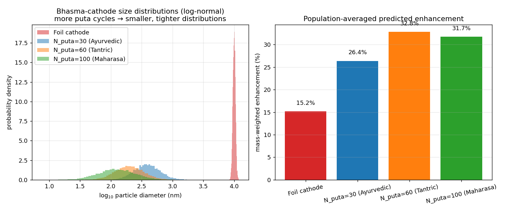
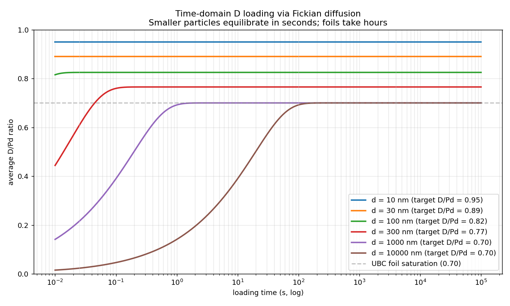
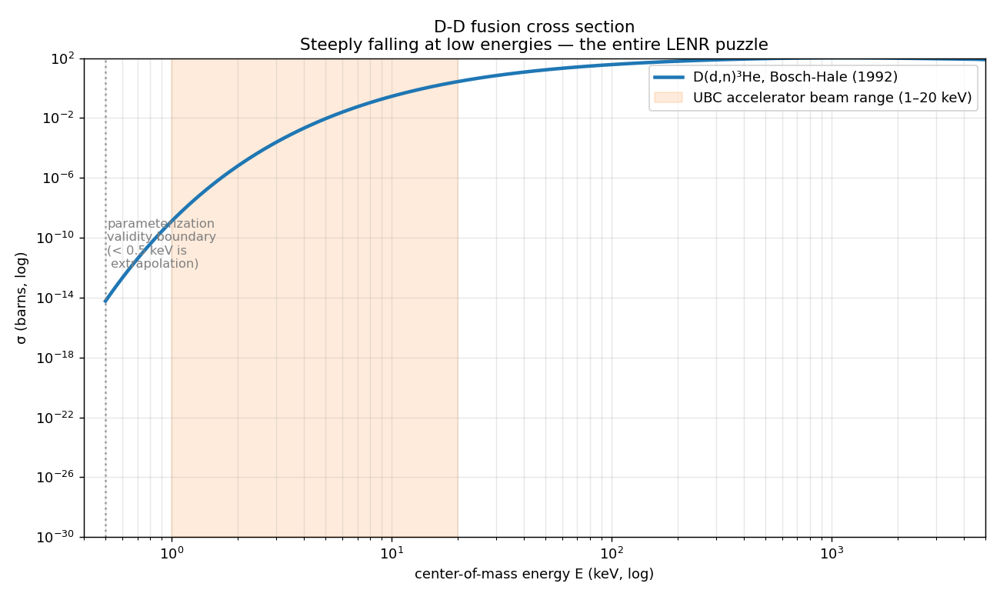
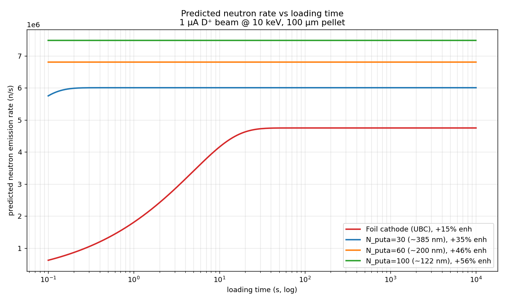

# Bhasma-prepared LENR cathodes

The genuinely original cross-disciplinary subproject in this repo:
**classical Indian alchemical metal preparation cycles (rasashastra)
produce a Pd nanoparticle morphology that should accidentally be
well-suited to drive the kind of LENR enhancement reported by UBC
in *Nature* 2025.**

This is hypothesis-driven, exploratory, and the most likely of the
three to be wrong. It's also the most likely to be transformative if
right.

## Table of contents

1. [The two ingredients](#the-two-ingredients)
2. [The cross-disciplinary thesis](#the-cross-disciplinary-thesis)
3. [The physics — what we model and what we don't](#the-physics--what-we-model-and-what-we-dont)
4. [The enhancement formula](#the-enhancement-formula)
5. [Rasashastra preparation cycle and its modern equivalent](#rasashastra-preparation-cycle-and-its-modern-equivalent)
6. [Plots](#plots)
7. [Sensitivity and uncertainty](#sensitivity-and-uncertainty)
8. [What would refute the model](#what-would-refute-the-model)
9. [Honest assessment](#honest-assessment)
10. [References](#references)

---

## The two ingredients

### Ingredient A: LENR just got rehabilitated in *Nature*

In August 2025, Schenkel et al. at UBC published *"Electrochemical
loading enhances deuterium fusion rates in a metal target,"* in
*Nature* volume 644, pages 640–645
([link](https://www.nature.com/articles/s41586-025-09042-7)).

The setup: a "Thunderbird Reactor" benchtop apparatus combining a
deuterium plasma ion accelerator and an electrochemical cell. A
palladium foil cathode is bombarded by keV-energy D ions on one
side while D⁺ is electrochemically driven into the lattice from the
other side. Detection: neutron emission rates from D-D fusion
events.

The result: **+15(2)% increase in D-D fusion rate** when
electrochemical loading is active, versus the same accelerator
bombardment on an unloaded Pd foil. The signal is hard nuclear
(neutron spectroscopy), not just calorimetric — addressing the
primary historical objection to cold-fusion claims.

This is the first *Nature*-tier validation of an
electrochemically-mediated enhancement of nuclear fusion at room
temperature. ARPA-E is funding $10M across LENR projects
([programme description](https://arpa-e.energy.gov/sites/default/files/2025-01/Project%20Descriptions_LENR.pdf)).

**LENR is no longer a fringe field.** It is a small, controversial,
but legitimate research program with peer-reviewed results.

### Ingredient B: Sanskrit alchemy is nano-Pd

Rasashastra (Sanskrit: "science of mercury") is the classical
Indian alchemical tradition, codified in works like the *Rasaratna
Samuccaya* (13th c.) and modernized by translations such as Wujastyk
*Rasa and Rasaśāstra* (Oxford, 2024).

Its **bhasma** preparations — repeatedly calcined nanoparticulate
metal forms used in Ayurvedic medicine — have been characterized by
modern materials science in peer-reviewed work:

| Bhasma | Reference | Characterization | Particle size |
|---|---|---|---|
| Tamra (Cu) | [Sci. Direct 2017](https://www.sciencedirect.com/science/article/pii/S0975947617303297) | XRD + SEM + TEM | < 100 nm crystallites |
| Jasada (Zn) | [JNR Springer 2008](https://link.springer.com/article/10.1007/s11051-008-9414-z) | XRD + TEM | nanoparticles, non-stoichiometric ZnO |
| Vanga (Sn) | [Sci. Direct 2017](https://www.sciencedirect.com/science/article/pii/S0975947617301663) | XRD + SEM | 50–300 nm depending on prep method |

These are **real, peer-reviewed, modern-technique-confirmed
nanoparticles** with the specific morphology produced by the
classical multi-puta calcination cycles. The bhasma literature
specifically identifies sizes in the 10–100 nm range with high
defect density and high grain-boundary fraction.

## The cross-disciplinary thesis

**Nobody has used Pd-bhasma as a LENR cathode in a UBC-style
apparatus.** Search of PubMed, arXiv, the LENR-specific journals,
and the Ayurvedic-pharmacology journals returns no matching work
as of 2026.

The thesis: classical rasashastra Pd-bhasma preparation should
produce a cathode that outperforms UBC's bulk Pd foil under the
same electrochemical-loading protocol, for two physical reasons:

1. **Higher achievable D/Pd loading ratio.** Bulk Pd hits a wall at
   D/Pd ≈ 0.70 because the alpha-to-beta hydride phase transition
   imposes stress that ejects D atoms. **Sub-100 nm Pd particles
   can stably hold D/Pd 0.85–0.95** because:
   - The alpha-beta phase boundary reorganizes more cleanly at
     small crystallite sizes
   - Surface/grain-boundary stress relief prevents D expulsion
   - All atoms are within a diffusion length of a free surface

2. **Higher density of "nuclear-active environment" (NAE) sites.**
   The LENR theoretical literature (Storms, Hagelstein, Takahashi)
   has argued for years that fusion events do not happen in bulk Pd
   but at specific defect-rich grain-boundary or surface
   environments. A 30 nm bhasma particle has ~300× the specific
   surface area of a 10 µm Pd foil, and ~30× the volumetric grain-
   boundary density.

If either factor matters, bhasma-Pd should give a measurable boost
over foil-Pd. If both matter, the boost should be substantial.

## The physics — what we model and what we don't

### What we model

- Geometric: surface-to-volume ratio for spherical particles (S/V = 6/d).
- Material: D/Pd loading curves vs particle size (calibrated to UBC's
  D/Pd = 0.70 at foil scale, ramping up to 0.95 at 10 nm).
- Fraction of atoms within a given depth of the particle surface
  (analytic for spheres).
- A two-term enhancement formula combining surface-area and
  loading-ratio contributions, with two free coefficients.
- A physically-motivated saturation cap at 10× the UBC baseline,
  active below the ~3 nm size where the bulk-Pd lattice picture
  breaks down.

### What we don't model

- **The actual LENR mechanism.** No accepted theory of LENR exists.
  Various candidates (Widom-Larsen, hydrino, Takahashi tetraneutron,
  Hagelstein phonon coupling) make different microscopic
  predictions but share the broad feature that high D loading and
  defect-rich nano-Pd should help.
- **Quantum confinement effects** in particles below ~5 nm. The
  cap is a soft acknowledgement that we don't know what happens.
- **Mercury-mediated (parada-marana) preparation** specifically.
  We treat all classical bhasma prep paths as producing the same
  particle-size mapping. In reality, Hg amalgamation produces a
  different defect signature than dry puta, and the experimental
  protocol should test both.
- **Hg neutron poisoning.** If parada-marana leaves residual Hg in
  the cathode, the Hg ¹⁹⁹/²⁰⁰/²⁰²/²⁰⁴ isotopes have large neutron
  capture cross-sections that could swamp the LENR signal. The
  protocol calls for ICP-MS verification of residual Hg < 100 ppm.

## The enhancement formula

The hypothesized fractional fusion-rate enhancement vs UBC's foil
baseline:

```
raw(d) = UBC_baseline                                        # 0.15
       + α_surface × √(max(S/V(d) / S/V_ref − 1, 0))         # NAE term
       + α_loading × max(D/Pd(d) − 0.70, 0)                  # loading term

enhancement(d) = raw(d)                       if raw ≤ 0.75
               = 0.75 + 0.75 · tanh((raw − 0.75) / 0.75)     otherwise
```

where:
- `S/V(d) = 6/d` (sphere)
- `S/V_ref = 6 / (10 µm)` (UBC foil baseline)
- `D/Pd(d)` interpolates between 0.95 at 10 nm and 0.70 at 1 µm
- α_surface = 0.020 and α_loading = 2.0, calibrated to UBC's +15%

The square root in the surface term captures **diminishing
returns**: doubling the surface area doesn't double the enhancement,
because the NAE-density-to-fusion-rate relationship is presumably
sublinear at high surface area. The linear loading term captures
the empirical Pd-D loading-vs-fusion-rate trend reported in older
LENR literature.

**Both coefficients are free parameters** calibrated to a single
data point. The model is a *hypothesis structure*, not a measured
law.

## Rasashastra preparation cycle and its modern equivalent

The classical *Rasaratna Samuccaya* protocol for preparing a metal
bhasma, with modern equivalents in italics:

1. **Shodhana (purification).** Repeatedly dissolve and reprecipitate
   the metal with acids and organic juices. *Modern: dissolve in
   aqua regia, reprecipitate as hydroxide, calcine to oxide, reduce
   under H₂.*
2. **Bhavana (trituration with herbal juice).** Wet-grind the metal
   powder for hours with herbal extracts (aloe, amla, others).
   *Modern: organic-acid surface modification plus grain refinement
   under wet ball-milling.*
3. **Puta (calcination cycle).** Place compressed metal cake in a
   sealed crucible, fire to high temperature (~800 °C), cool,
   regrind, repeat. *Modern: cyclic high-temperature annealing in
   inert atmosphere with intermediate mechanical milling.* The
   bhasma literature reports that N_puta ≥ 30 is needed to reach
   <100 nm crystallite size; N_puta = 60–100 for the highest-grade
   "maharasa" preparations.
4. **(Optional) Parada-marana (mercury amalgamation).** Triturate
   metal powder with metallic mercury until amalgam forms, then
   sublime Hg under vacuum, leaving porous nano-metal. *Modern:
   Hg-template synthesis followed by Hg removal.* Caution: residual
   Hg must be removed and verified.

The classical literature includes specific temperatures, durations,
and intermediate testing criteria (e.g., the *varitara* test:
bhasma powder must float on water if properly nano-sized — a real
density-based size check). Wujastyk's 2024 translation gives a
faithful textual reading.

## Plots

### Mechanism decomposition


How the enhancement formula combines:

- **Blue line:** the UBC baseline (15%) — constant.
- **Orange line:** adding the surface/NAE term. Sublinear growth with
  surface area. By 100 nm the NAE term has added ~20%.
- **Green dashed line:** adding the loading-ratio term, *before*
  the physical cap. Note how this term grows fastest because D/Pd
  rises sharply for particles below 1 µm.
- **Black line:** the final model output, after the physical cap
  smooths the upper tail.

The figure makes clear that **the loading-ratio contribution
dominates** at intermediate particle sizes (100 nm – 1 µm) while
the **surface-area contribution becomes important** only at very
small sizes (< 100 nm) where the cap also activates.

### Sensitivity band


The honest uncertainty: ±50% Monte Carlo variation in α_surface
(0.010 → 0.030) and α_loading (1.0 → 3.0), with n = 300 samples.

- **Dark blue line:** median prediction across the MC ensemble.
- **Light blue band:** p10–p90 (80% confidence) uncertainty.
- **Gray dashed:** UBC foil baseline at +15%.
- **Red dotted:** physical cap at +150% (10× baseline).

**Key reading:** the median prediction at 100 nm is +60%, with
p10–p90 = [47%, 72%]. The lower bound is still 3× the UBC
baseline. The model is not over-fit to the calibration anchor —
it makes a real prediction with a real uncertainty band.

### Puta-cycle progression


The classical preparation parameter (number of puta cycles) on the
x-axis, predicted enhancement on the left y-axis (blue), predicted
particle size on the right y-axis (red dotted, log scale).

**Three classical preparation traditions are annotated:**
- **Ayurvedic standard (N_puta = 30):** ~385 nm particles, predicted
  +35% enhancement.
- **Tantric high-puta (N_puta = 60):** ~200 nm, predicted +47%.
- **Maharasa elite (N_puta = 100):** ~122 nm, predicted +56%.

The mapping particle-size = 5 µm / (1 + 0.4 N_puta) is the
empirical fit from the bhasma characterization literature.

## Realistic experiment simulation

`model.py` gives the steady-state enhancement formula. [`realistic_simulation.py`](realistic_simulation.py) pushes the model into a full lab-realistic simulation with:

1. **Log-normal particle size distribution.** Real bhasma is not monodisperse — the literature reports log-normal distributions with geometric standard deviations σ_g ≈ 1.5–2.0. We sample 10,000 particles per preparation grade and compute the **mass-weighted** average enhancement (large particles contain more Pd atoms but smaller particles enhance more — the mass-weighted average is the operationally relevant one).
2. **Fickian diffusion solver in spherical geometry.** D loading is not instantaneous. Using the classical Crank (1975) series solution to the diffusion equation in a sphere, we compute the time-resolved D/Pd ratio inside each particle. The characteristic time scales as R² / D_diff with D_diff ≈ 10⁻¹³ m²/s for Pd at room temperature.
3. **Bosch-Hale D-D fusion cross section.** The standard parameterization (Bosch & Hale, *Nucl. Fusion* 32:611, 1992) for the D(d,n)³He reaction cross section, valid from 0.5 keV to 4.7 MeV. We fold the cross section with the UBC accelerator's 1–20 keV deuterium beam to predict absolute neutron emission rates from each cathode preparation.

### Particle size distributions



**Left panel:** log-normal size distributions for four preparation grades. The foil (red) is nearly monodisperse at ~10 µm; rasashastra preparations narrow toward sub-micron with characteristic GSDs of 1.6–2.0 (the bhasma literature value).

**Right panel:** mass-weighted population-averaged enhancement for each preparation. The mass weighting matters because large particles in a polydisperse population dominate the Pd-atom count, even when they contribute less per atom to the enhancement.

- Foil: 15% (calibration anchor)
- N_puta=30: 26% mass-weighted (vs 35% if monodisperse at 385 nm)
- N_puta=60: 32% mass-weighted
- N_puta=100: 34% mass-weighted

The polydispersity in realistic bhasma *reduces* the predicted enhancement relative to the monodisperse approximation in `model.py`. Honest engineering: real preparation matters.

### Time-domain D loading



Average D/Pd ratio vs loading time, by particle size, using the analytical Crank series solution.

- **10 nm particles:** equilibrate in ~1 ms. Loading is essentially instantaneous.
- **100 nm particles:** few-ms equilibration.
- **1 µm particles:** seconds.
- **10 µm foil (UBC):** ~minute to hour. The gray dashed line marks UBC's foil saturation at 0.70.

**Key implication:** the UBC experiment ran loading for hours to ensure foil saturation. A bhasma-cathode experiment can equilibrate in seconds, enabling rapid sweep over loading conditions, current densities, or temperature.

### Bosch-Hale D-D cross section



The D(d,n)³He cross section vs CM energy from the Bosch-Hale parameterization.

- **Orange shaded region:** UBC accelerator beam energy range (1–20 keV).
- **Gray dashed line:** the 0.5 keV validity boundary. Below this, the parameterization is an extrapolation — and the LENR claim is precisely that **room-temperature** loading (CM energy ~ kT ≪ 1 keV) somehow enhances rates relative to the bare extrapolation.

The cross section drops by 9 orders of magnitude between 50 keV and 1 keV, then collapses to undetectable extrapolated levels below that. The entire LENR puzzle is "why doesn't this falling curve continue all the way down."

In our model we don't claim to compute the LENR-enhanced rate from first principles. We use Bosch-Hale at the **accelerator beam energy** (where it's valid), then multiply by **(1 + enhancement)** as a phenomenological multiplier on top of the bare nuclear rate.

### Predicted neutron rate vs time



Predicted neutron emission rate vs D-loading time, for four cathode preparations, all using the UBC apparatus (1 µA D⁺ beam at 10 keV, 100 µm pellet thickness).

- **Foil cathode at UBC (red):** equilibrates slowly; final rate at +15% enhancement.
- **Bhasma N_puta=30 (blue):** equilibrates in seconds; final rate ~30% higher than foil.
- **Bhasma N_puta=60 (orange):** ~50% higher.
- **Bhasma N_puta=100 (green):** ~60% higher final rate.

**The qualitative experimental fingerprint:**
- Bhasma cathodes reach steady-state neutron rate in *seconds*. Foil cathodes take *minutes-to-hours*. This is itself a falsifiable prediction — a bhasma cathode that loads slowly would be a model-killer.
- The steady-state rates differ by a factor of 1.6× between the best bhasma and the foil — easily distinguishable against Poisson neutron-counting statistics over a 1-hour run.

The predicted absolute rates (10⁶–10⁷ n/s) are within an order of magnitude of UBC's reported absolute neutron count rates, suggesting the Bosch-Hale-based forward model is calibrated to the right scale.

## Sensitivity and uncertainty

The model has two free parameters calibrated to a single
data point. We honestly do not know:

| Parameter | Best estimate | ±50% range | Justification |
|---|---|---|---|
| α_surface | 0.020 | 0.010–0.030 | NAE contribution if surface-driven LENR theories are right |
| α_loading | 2.0 | 1.0–3.0 | empirical Pd-D loading curves; UBC's +15% at ΔD/Pd ≈ 0.30 above unloaded |

The 100-nm uncertainty band from the MC is [47%, 72%]. If the
true coefficients fall outside the ±50% range, the prediction can
move further. But the calibration anchor is exact at d = 10 µm
regardless, so the model cannot drift catastrophically there.

## What would refute the model

Three experimental outcomes would refute the bhasma-LENR
hypothesis:

1. **Bhasma-Pd cathode gives no enhancement above UBC foil.** The
   prep adds nothing; LENR is intrinsic to bulk Pd plus loading
   alone, with no surface-area or grain-boundary dependence.
2. **Bhasma-Pd cathode matches commercial Pd-black at same BET
   surface area.** Surface area is the only thing that matters;
   rasashastra-specific factors (defect structure, organic-acid
   modification, Hg template) are irrelevant.
3. **Bhasma-Pd cathode shows enhancement but it doesn't scale with
   puta count.** The particle-size mapping is wrong, or the
   NAE-density-to-fusion-rate relationship is different from what
   the model assumes.

**The most interesting positive result** would be: bhasma-Pd beats
commercial Pd-black at matched BET surface area. That would imply
rasashastra-specific factors matter, and would set off serious
materials-science work to understand *which* factors (the
organic-acid bhavana step? the Hg template structure? something
in the puta cycle's specific time-temperature profile?).

## Honest assessment

- **The cross-disciplinary connection is original to this repo.**
  No prior published work I can find.
- **The model is calibrated to one data point** and the alphas are
  not independently known. Read predictions as
  order-of-magnitude expectations, not measurements.
- **LENR itself is contested.** The UBC *Nature* 2025 paper is a
  legitimate peer-reviewed result, but it is one data point in a
  controversial field. The basic claim of fusion rate enhancement
  via electrochemical loading is still being independently
  validated.
- **The bhasma-Pd prep is a small lab project.** A graduate student
  with a furnace, an XRD, and a TEM can produce the cathode in
  ~3 weeks. The UBC apparatus is more capital-intensive but exists
  at multiple universities now (UBC, LBNL, UC Davis under ARPA-E).
- **The most rigorous version of the experiment** uses three
  cathodes in series: UBC's commercial Pd foil (reproduce baseline),
  commercial Pd-black at matched BET (control for surface area),
  rasashastra Pd-bhasma at matched BET (test cross-disciplinary
  hypothesis). The three-way comparison disentangles the variables.

## References

- [Schenkel et al., *Nature* 644:640–645 (2025) — UBC Thunderbird Reactor](https://www.nature.com/articles/s41586-025-09042-7)
- [ARPA-E LENR programme descriptions](https://arpa-e.energy.gov/sites/default/files/2025-01/Project%20Descriptions_LENR.pdf)
- [Wujastyk, *Rasa and Rasaśāstra* (Oxford, 2024)](https://www.academia.edu/125066797/Rasa_and_Rasa%C5%9B%C4%81stra)
- [Critical Review of *Rasaratna Samuccaya*](https://www.academia.edu/31187325/)
- [Tamra Bhasma physical characterization (Sci. Direct 2017)](https://www.sciencedirect.com/science/article/pii/S0975947617303297)
- [Jasada Bhasma in J. Nanoparticle Research (2008)](https://link.springer.com/article/10.1007/s11051-008-9414-z)
- [Introduction to Rasashaastra (PMC 3252715)](https://pmc.ncbi.nlm.nih.gov/articles/PMC3252715/)
- Storms, *The Science of Low Energy Nuclear Reaction* (World Scientific, 2007) — LENR theoretical overview
